# TimeRegistration — van Duyn & Haverkamp

A time & billing application for a Dutch law firm: firm-wide time capture, weekly
approval through a Mendix Workflow, and monthly client reporting.

Built from a design handoff with [mxcli](https://github.com/ako/mxcli) and MDL —
the whole application is defined by the scripts in `TimeRegistration/mdlsource/`,
so it rebuilds from source. No screen, microflow or access rule was drawn by hand.

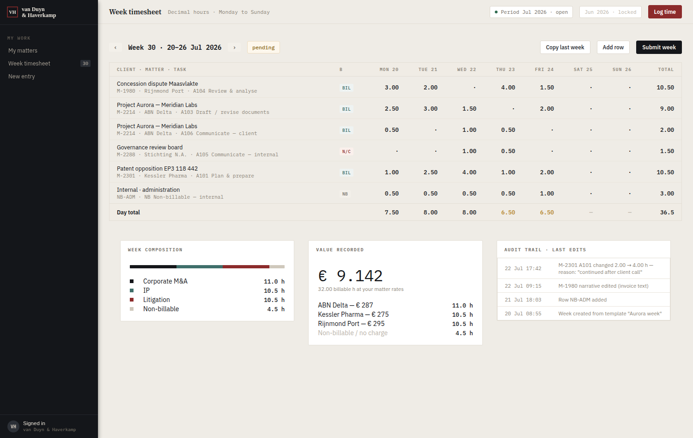

## Running it

```bash
bash scripts/setup-tools.sh          # toolchain (runs automatically each session)
cd TimeRegistration
./mxcli run --local -p TimeRegistration.mpr --ensure-db --watch
# -> http://localhost:8080
```

The database seeds itself on first boot. Sign in with any account below —
password `VdhDemo2026!`:

| Account | Role | Sees |
|---|---|---|
| `m.devries@vdh-law.nl` | fee earner | their own matters, week and entries |
| `j.haverkamp@vdh-law.nl` | partner | + task inbox, approvals, rollup, reports |
| `praktijkbeheer@vdh-law.nl` | practice management | + the rate card |

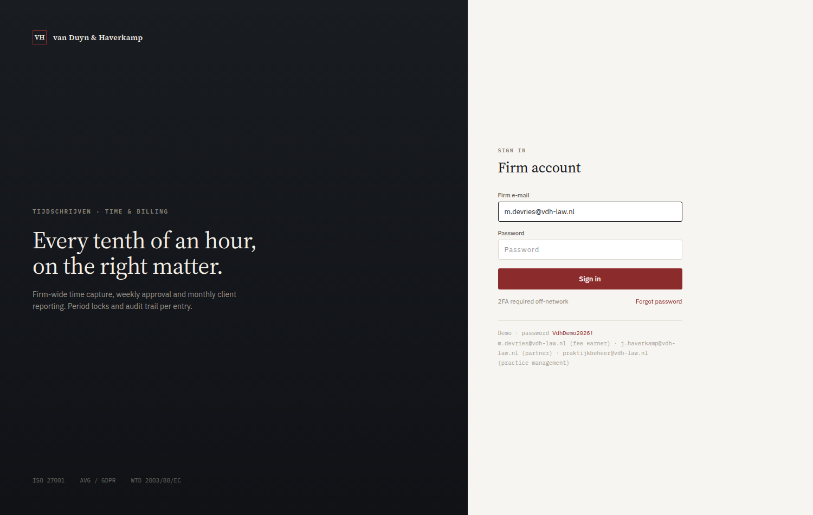

## Recording time

A fee earner's week is a matter × task grid with seven day columns. ‹ › move
between weeks — opening a week is what creates it — and **Copy last week** brings
the previous week's rows over as empty ones, because re-picking eight matter/task
pairs is the tedious part and the hours are the one thing nobody should be handed
a default for.

Everything under the grid is derived from the entries: the composition bar from
each matter's practice area, the value lines from the rate that was actually
applied, the audit trail from what happened.

| My matters | Time entry |
|---|---|
| 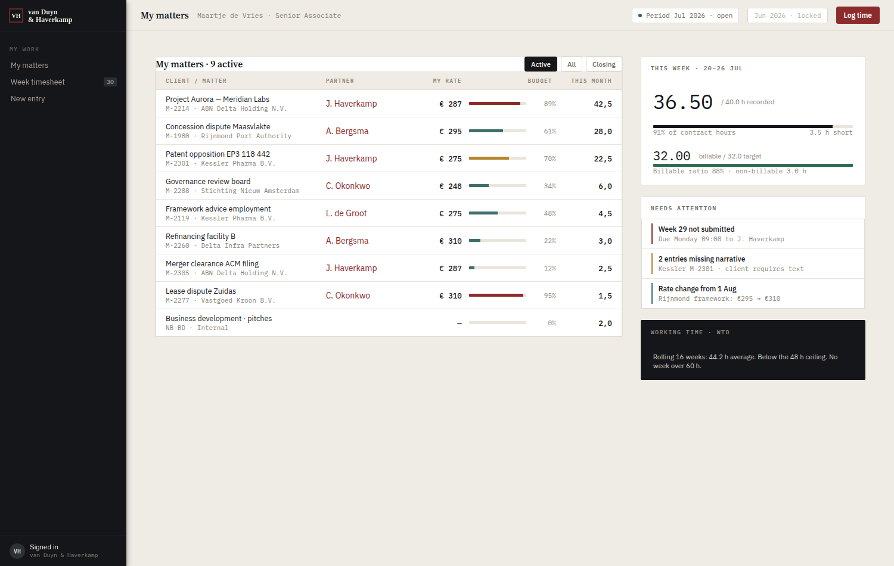 | 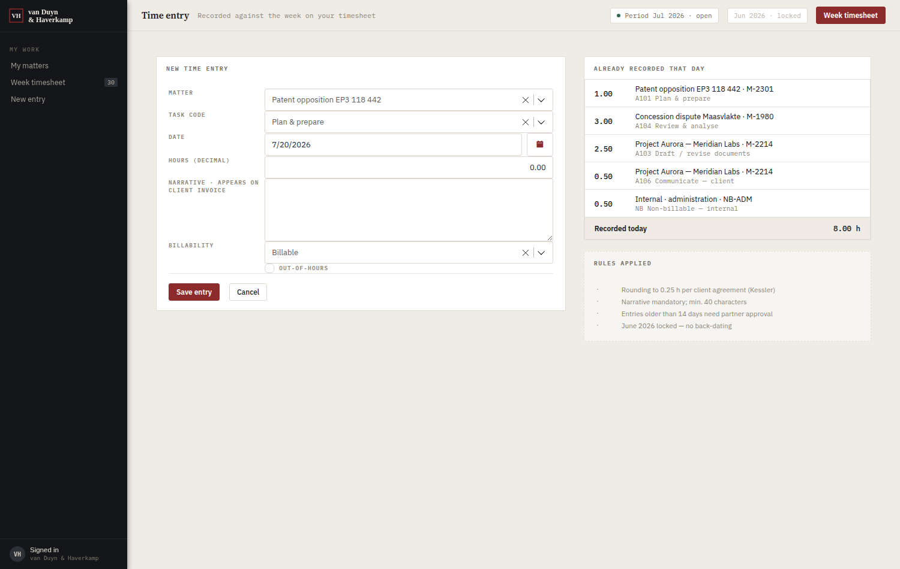 |

## Approval is a real workflow

Submitting a week starts `TimeReg.TimesheetApproval` — a Mendix Workflow, not a
status field. It assigns a task to the fee earner's supervising partner, gives it
a due date the engine tracks, and records who decided what.

| My tasks — the approver's inbox | The approval task |
|---|---|
| 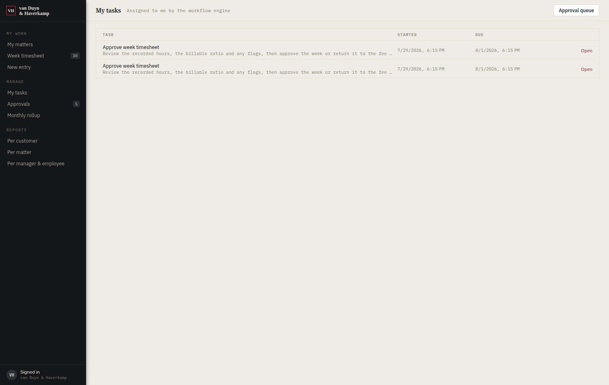 | 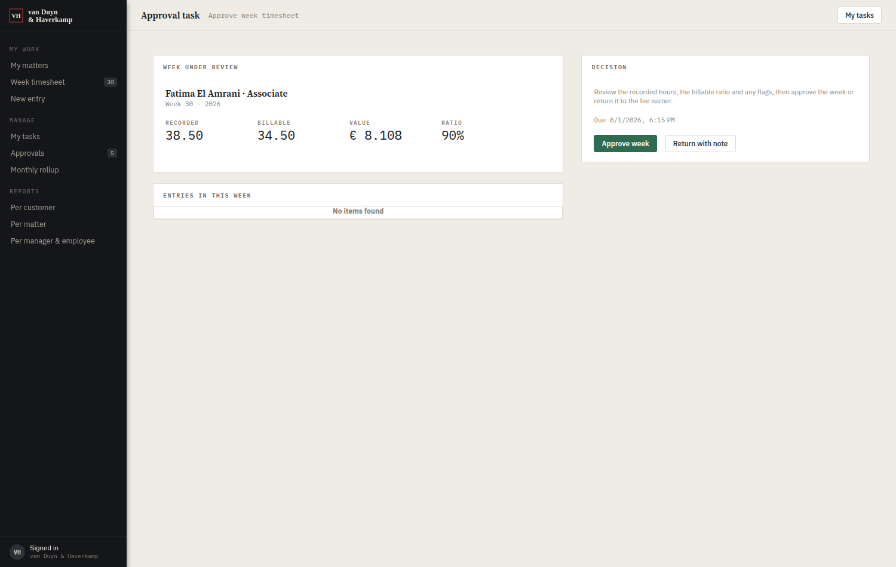 |

The buttons on the task only claim it and set its outcome; the workflow's own
outcome branch does the work. The team approvals queue is still there, but its
row button opens the task rather than approving in place, so a week cannot be
approved behind the workflow's back.

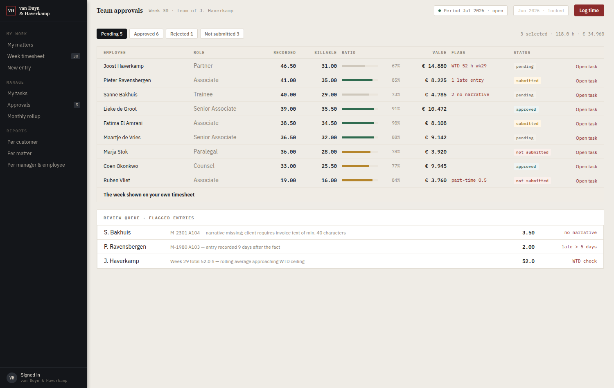

## Reporting

The rollup and the three reports follow a selected period, one month at a time.
July 2026 is the seeded snapshot matching the design handoff; step to any other
month and it is created and summarised from the entry table on the spot.

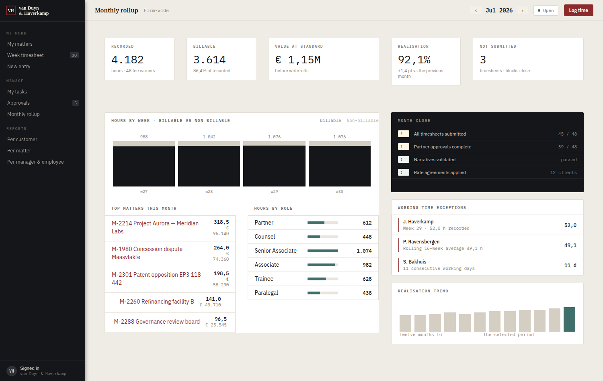

<details>
<summary><b>The three report screens and the rate card</b></summary>

<br>

**Per customer** — approved time by client, role mix, realisation, statement
distribution.

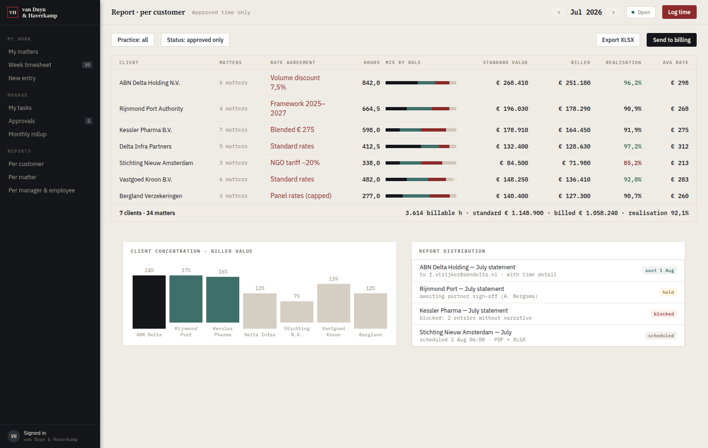

**Per matter** — task breakdown, team, burn against budget.

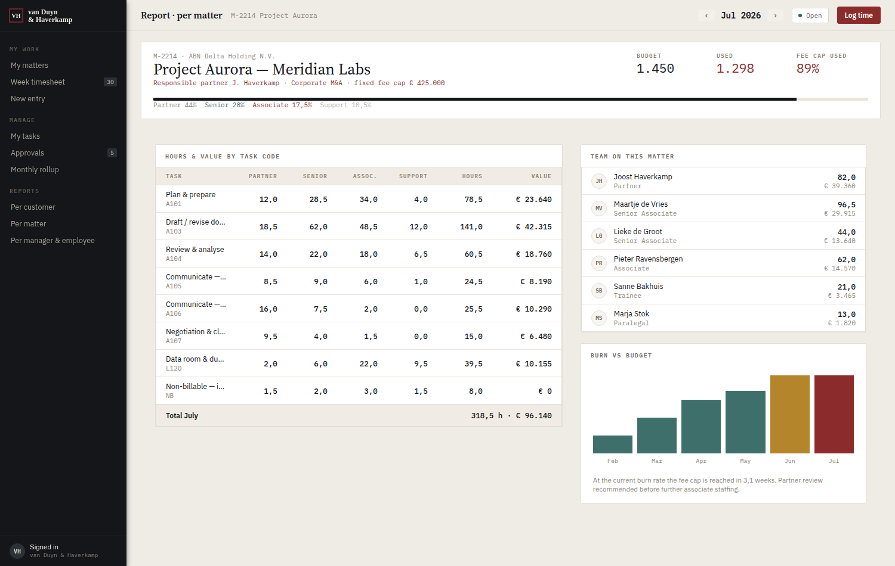

**Per manager & employee** — utilisation, value, cost and margin.

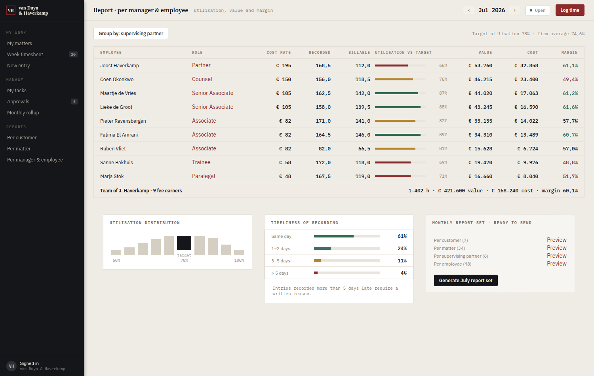

**Rate card** — the standard card and the negotiated client matrix *as it stood
in the selected month*. Rates are effective-dated, so stepping back to June shows
Rijnmond before its 1 July indexation and April shows no Kessler agreement at
all. The same resolver prices time entries, so the card and the invoice can never
disagree.

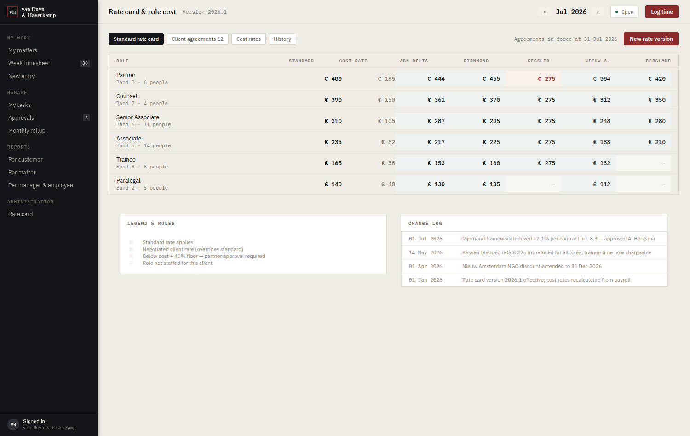

</details>

## Security

Production security level, three roles, row-level XPath access rules — verified
by signing in as each of them rather than by reading the matrix. A fee earner
sees three menu items and their own week; a partner sees the people who report to
them; nobody reaches another fee earner's time.

## Documentation

- **[APP.md](APP.md)** — what the app does, its domain model, the workflow, the
  week and period machinery, the security model, and where it departs from the
  handoff and why.
- **[FINDINGS.md](FINDINGS.md)** — every mxcli bug, surprise and workaround hit
  while building it, numbered, with the exact command and output, plus a retest
  against the upstream PR that fixed eighteen of them.
- **[TOOLING.md](TOOLING.md)** — installed versions, the pinned mxcli commit, and
  how the toolchain re-establishes itself each session.

## Layout

```
scripts/setup-tools.sh          idempotent toolchain bootstrap
TimeRegistration/
  mdlsource/                    the application, in dependency order
    01–13   domain model, demo data
    20–22   business logic and datasources
    29–41   pages, navigation, settings
    50–58   identity and the security model
    59–65   the approval workflow
    70–75   multi-week support
    76–80   period-aware reporting
    81–83   effective-dated rates
  theme/web/_vdh.scss           the design language
docs/screenshots/               the images above
```

The scripts are numbered because they run in that order — a rebuild from an empty
project is a pass over `mdlsource/*.mdl`. Against a project that already exists
most of them re-run cleanly, but the nine that create the domain model, the
account association, the module roles and the demo-user cleanup use plain
`create` and will refuse; see findings 23 and 51 for why that is worth knowing
before you write a script of your own.
